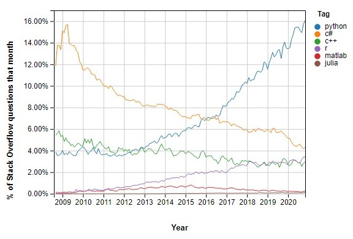

# Introduction to Numerical Python for Engineers

**Hello**! Numerical programming is becoming a key skill for modern engineers and you will need to use Python in some of your modules for labs and coursework. This is a quick introduction to numerical programming in [Python](https://www.python.org/) using a set of interactive  [Jupyter](https://jupyter.org/) notebooks. 
1. [Python Basics](https://colab.research.google.com/github/weymouth/NumericalPython/blob/main/01PythonBasics.ipynb)
1. [Conditionals and Lists](https://colab.research.google.com/github/weymouth/NumericalPython/blob/main/02ConditionalsAndLists.ipynb)
1. [Numerical Python and Plotting](https://colab.research.google.com/github/weymouth/NumericalPython/blob/main/03NumpyAndPlotting.ipynb)

## How to complete this introduction?

You can use these notebooks in two ways:
- You can run the notebooks on [google colab](https://research.google.com/colaboratory/faq.html). This is extremely convenient, requiring nothing but a Google account! Just click the links above to get started.
- Alternatively, you can run the notebooks on your own machine. To do this, you need to download this github repository using the green `code` button above; for example as a [zip file](https://github.com/weymouth/NumericalPython/archive/main.zip) or using github desktop. If you haven't already, you should also [install Anaconda](https://docs.anaconda.com/anaconda/install/). This will install Python and the Jupyter notebook environment, letting you run the notebooks locally.

## Why use programming for analysis?

The programming approach is **highly** preferred to using spreadsheets (like `Excel`) which are [extremely dangerous to use for important work](https://www.forbes.com/sites/timworstall/2013/02/13/microsofts-excel-might-be-the-most-dangerous-software-on-the-planet/?sh=536d1fa0633d). Well documented spreadsheet errors have led to catastrophes in [business](https://www.marketwatch.com/story/88-of-spreadsheets-have-errors-2013-04-17), [economic policy](https://www.bloomberg.com/news/articles/2013-04-18/faq-reinhart-rogoff-and-the-excel-error-that-changed-history) and [health care](https://www.theguardian.com/politics/2020/oct/05/how-excel-may-have-caused-loss-of-16000-covid-tests-in-england). This is because:
- Spreadsheets *hide their methodology* behind the data. This makes it extremely difficult to transfer methods to new data and to find errors. In contrast, a program *is* the methodology, making testing and reproduction much easier.
- Spreadsheets are not extensible. Their available numerical methods make them inappropriate for any advanced engineering analysis.

## Why use Python?

Python is not the only programming language for numerics, but it has a few important advantages:
- Python is in high demand. This means learning Python is a good way to improve your job prospects; particularly for engineering positions related to data-science and machine learning.
- Python has the largest and best organized community of users and developers. The figure above was generated on [stackoverflow](https://insights.stackoverflow.com/trends) and show that Python's user base five times larger than any other programming language used for numerical work. This means the methods in Python are world class and modern, and it is very easy to get help.
- It is open-source and free to use. This helps the community grow and also ensures future employers can use your skills - no need to pay for a Matlab license. 
- Python is easy to learn and the lessons are generally transferable to other languages. A basis in Python will help make other modern languages like [Julia](https://julialang.org/) and [R](https://www.r-project.org/about.html) more approachable. 

## What if I need more help?

This introduction is meant to get you familiar with numerical Python as quickly as possible. It assumes very little knowledge of programming, but accelerates quickly up to fairly advanced examples. If you are a complete beginner or if you prefer a slower pace then you might try these additional resources:
 - https://www.udemy.com/course/python-for-absolute-beginners-u/
 - https://www.kaggle.com/learn/overview
 - https://docs.python.org/3/tutorial/
 - https://numpy.org/devdocs/user/quickstart.html
